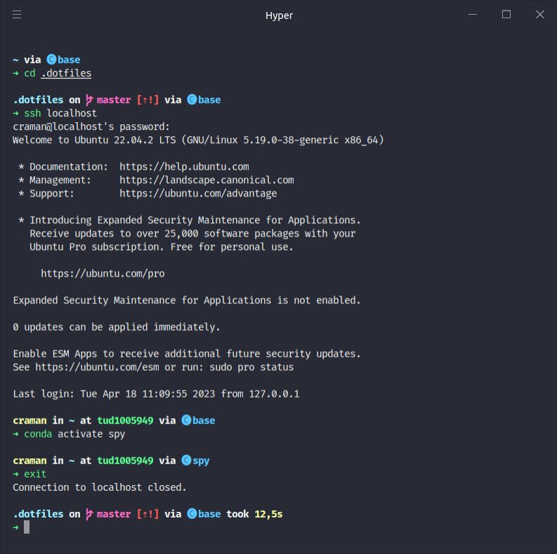

# chiragraman does dotfiles
<!--  -->
<p align="center">
    
</p>

Your dotfiles are how you configure your system. These are mine.

After spending hours configuring my machine to my liking, I realized that the files weren't organized in a way conducive to synchronizing them across machines. A quick gander through the interwebs for pointers led to my discovery of [Github does dotfiles](https://dotfiles.github.io/), and subsequently [Zach Holman's sweet setup](https://github.com/holman/dotfiles). This setup mimics his topical organization. Midway through the project I decided to jump ship to zsh. I'm currently using the [Hyper](https://hyper.is/) terminal with [Snazzy](https://github.com/sindresorhus/hyper-snazzy), running ZSH with [Speaceship](https://github.com/pascaldevink/spaceship-zsh-theme).

## components

There's a few special files in the hierarchy.

- **bin/**: Anything in `bin/` will get added to your `$PATH` and be made
  available everywhere.
- **Brewfile**: This is a list of applications for [Homebrew](http://brew.sh/)
  and [Homebrew Cask](http://caskroom.io) to install things like Chrome, Atom
  etc. You might want to edit this file before running any initial setup.
- **topic/\*.zsh**: Any files ending in `.zsh` get loaded into your environment.
- **topic/path.zsh**: Any file named `path.zsh` is loaded first and is expected
  to setup `$PATH` or similar.
- **topic/completion.zsh**: Any file named `completion.zsh` is loaded last and
  is expected to setup autocomplete.
- **topic/\*.symlink**: Any files ending in `*.symlink` get symlinked into your
  `$HOME`. This is so you can keep all of those versioned in your dotfiles but
  still keep those autoloaded files in your home directory. These get symlinked
  in when you run `script/bootstrap`.
- **topic/install.sh**: Any file with this name and with exec permission, will
  be executed during the bootstrap phase.


## install

Run the following commands:

```sh
git clone https://github.com/chiragraman/dotfiles.git ~/.dotfiles
cd ~/.dotfiles
script/bootstrap
```

This will symlink the appropriate files in `.dotfiles` to your home directory.
Everything is configured and tweaked within `~/.dotfiles`.

The main file you'll want to change right off the bat is `zsh/zshrc.symlink`,
which sets up a few paths that'll be different on your particular machine.

`dot_update` is a simple script that installs some dependencies, sets sane OS X
defaults, and so on. Occasionally run `dot_update` to keep your environment fresh and up-to-date. You can find
this script in `bin/`.

## thanks

I originally started by forking [Zach Holman's repository](https://github.com/holman/dotfiles), and made updates based on [Carlos Becker's setup](https://github.com/caarlos0/dotfiles). There's a decent amount of code here that I've copied from other repositories as well, so it's pretty sweet to see people share their workflows!
